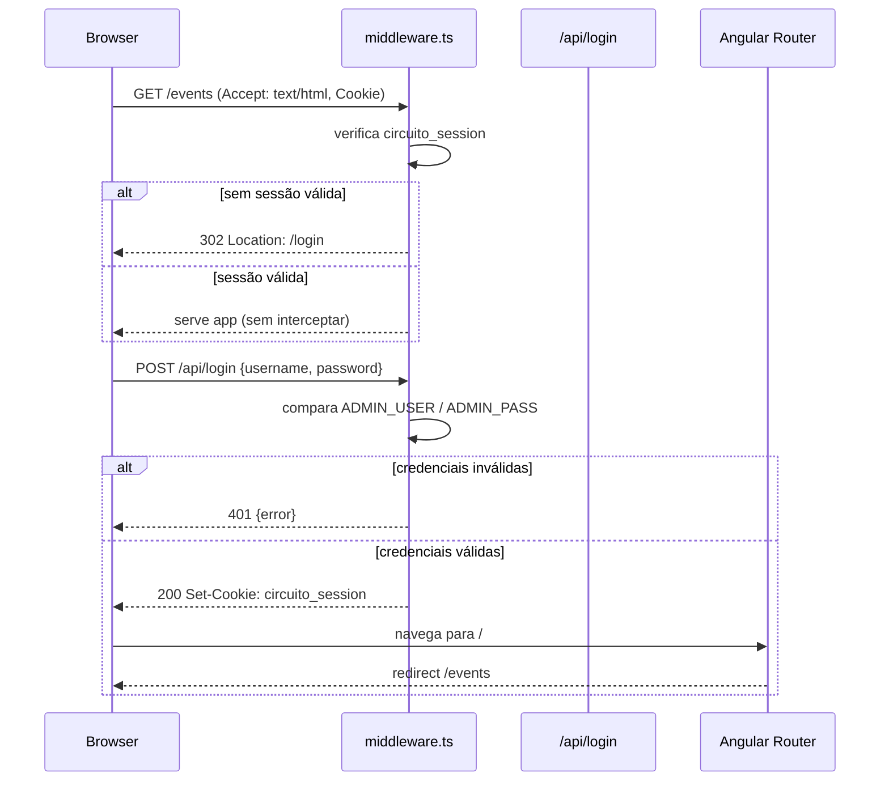
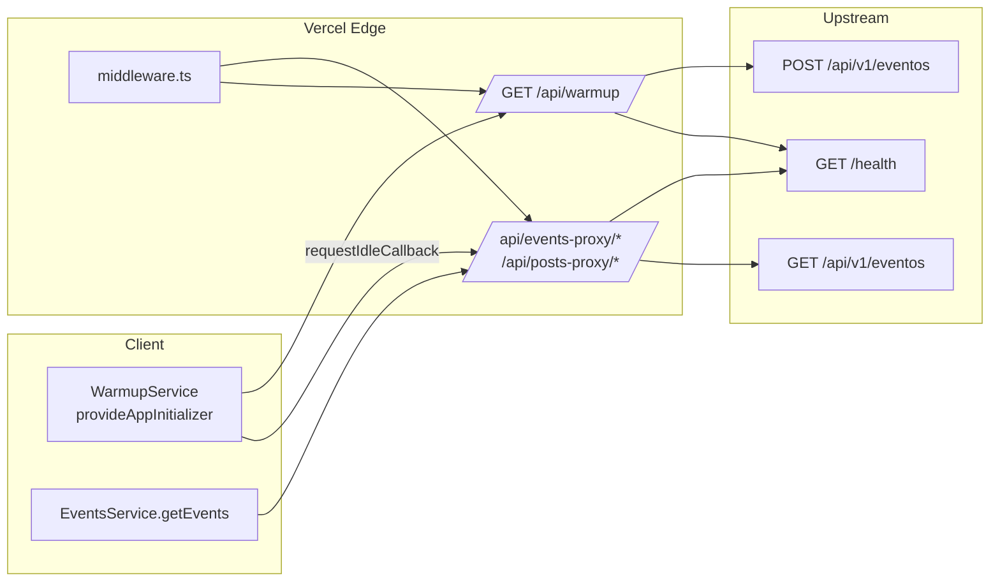
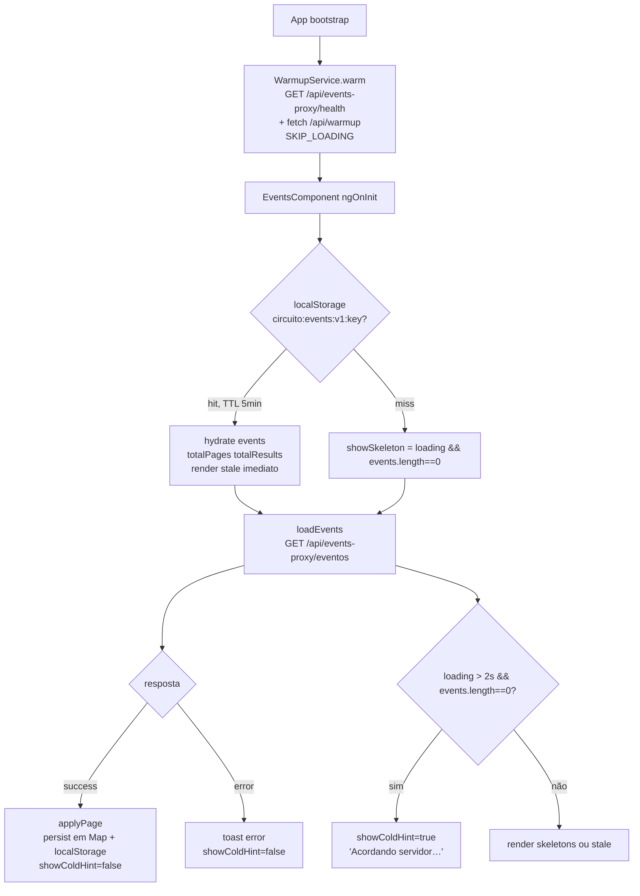
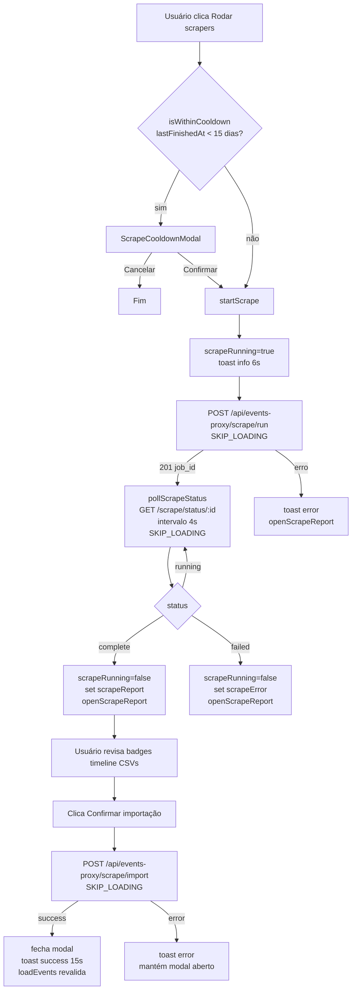

# Circuito ADM

Painel administrativo para gestão de eventos, publicação de postagens e operação de scrapers do Circuito. Construído com Angular em modo standalone e implantado na Vercel com Edge Middleware para autenticação e proxy de APIs.

## Funcionalidades

- **Autenticação** — Login com cookie `HttpOnly` (`circuito_session`). O middleware protege todas as rotas exceto `/login` e expõe `/api/login`, `/api/logout` e `/api/me`.
- **Eventos** — Listagem paginada (9 por página), busca com debounce, CRUD completo, formulário com kits e validação de campos obrigatórios, sincronização com bucket externo.
- **Scrapers** — Fluxo assíncrono: `POST /scrape/run` cria job, polling de `GET /scrape/status/:id` a cada 4s, modal de cooldown de 15 dias, relatório com timeline e validação de CSVs.
- **Relatório de coleta** — Badges compactos por fonte (expansão e detalhe de `stderr`/`detail`), timeline proporcional ao scraper mais lento com marca de gargalo, tabela de CSVs com filtro `Só com alertas` e ordenação por total/duplicados/nome, estados vazios ilustrados e importação via `Confirmar importação`.
- **Postagens** — Criação com upload de imagem, geração de slug e validação de campos obrigatórios.
- **Feedback** — Toasts com duração configurável (`success` 5s, `info` 6s, `error` 7s, importação 15s) e confirmação modal para exclusões.

## Stack

| Tecnologia   | Versão                                                  |
| ------------ | ------------------------------------------------------- |
| Angular      | v22 (standalone, zoneless, `provideAppInitializer`)      |
| TypeScript   | v6                                                      |
| Tailwind CSS | v3                                                      |
| RxJS         | v7                                                      |
| Vercel       | Build estático + Edge Middleware (`middleware.ts`)       |

## Pré-requisitos

- Node.js >= 18 (recomendado 20 LTS)
- npm >= 9

## Configuração de ambiente

Variáveis podem ser definidas em `.env` na raiz ou como environment variables do sistema/CI. O script `scripts/generate-env.js` gera `src/environments/environment.ts` antes de `prestart` e `prebuild`.

```env
API_URL=https://circuitoapp-api.wittywater-facd8580.chilecentral.azurecontainerapps.io/
API_KEY=
POSTS_API_URL=
POSTS_API_KEY=
ADMIN_USER=
ADMIN_PASS=
SCRAPERS_API_KEY=
```

### Variáveis

| Variável           | Descrição                                      |
| ------------------ | ---------------------------------------------- |
| `API_URL`          | URL base da API de eventos (Azure Container Apps) |
| `API_KEY`          | Chave `x-api-key` para `POST /eventos` e `GET /eventos` |
| `POSTS_API_URL`    | Endpoint de publicação de posts (Lambda URL)   |
| `POSTS_API_KEY`    | Chave para o endpoint de posts                 |
| `SCRAPERS_API_KEY` | Chave para `POST /scrape/run`, `GET /scrape/status/:id`, `POST /scrape/import` e `GET /scrape/last-run` |
| `ADMIN_USER`       | Usuário do painel                              |
| `ADMIN_PASS`       | Senha do painel                                |

Exemplo em `.env.example` e geração via `npm run generate-env`.

## Execução local

```bash
npm install
npm start
```

Servidor em `http://localhost:4200`. O `prestart` executa `generate-env` automaticamente.

### Scripts

| Comando         | Descrição                    |
| --------------- | ---------------------------- |
| `npm start`     | Servidor de desenvolvimento  |
| `npm run build` | Build de produção            |
| `npm run watch` | Build em modo watch          |
| `npm test`      | Testes com Karma / Jasmine   |

## Rotas

| Rota      | Visibilidade | Descrição                    |
| --------- | ------------ | ---------------------------- |
| `/login`  | Pública      | Autenticação                 |
| `/events` | Protegida    | Listagem e gestão de eventos |
| `/posts`  | Protegida    | Publicação de postagens      |

`/` redireciona para `/events`. O guard `authGuard` e o middleware validam o cookie `circuito_session` em cada requisição.

## Arquitetura

### Middleware e proxy

`middleware.ts` atua como Edge Function com `matcher: ['/(.*)']`:

- Autenticação: `/api/login`, `/api/me`, `/api/logout`, redirecionamento para `/login` quando `Accept: text/html` e sem sessão válida.
- Proxy de eventos: `/api/events-proxy/*` → `${API_URL}/api/v1/*` (exceção: `health` → `${API_URL}/health`), injeta `x-api-key` de `API_KEY` ou `SCRAPERS_API_KEY` para rotas `/scrape/*`, verifica sessão.
- Proxy de posts: `/api/posts-proxy/*` → `${POSTS_API_URL}/*`.
- Warmup: `GET /api/warmup` dispara `fetch(${API_URL}/health)` e `fetch(${POSTS_API_URL}/)` sem bloquear a resposta, usado por `WarmupService` e por pings externos.

Em desenvolvimento (`isDevMode()`), as chamadas usam `environment.apiUrl` e `environment.postsApiUrl` diretamente com `x-api-key` via `HttpHeaders`. Em produção, passam pelo proxy para não expor chaves ao browser.

### Cold start

A API de eventos roda em Azure Container Apps com `minReplicas=0`. O primeiro `GET /eventos` pode levar 6–15s. Mitigação sem custo adicional:

- `WarmupService` (`src/app/core/services/warmup.service.ts`) registrado com `provideAppInitializer` em `src/app/app.config.ts` faz `GET /api/events-proxy/health` e `fetch('/api/warmup')` em `requestIdleCallback` após o bootstrap, com `SKIP_LOADING` para não acionar skeletons.
- `EventsService` (`src/app/features/events/services/events.service.ts`) persiste o último `EventPage` por chave (`p:1`, `q:termo:1`) em `localStorage` com TTL de 5 minutos. `EventsComponent` restaura o stale em `ngOnInit` para renderização imediata (SWR) e revalida em segundo plano.
- `EventsComponent` (`src/app/features/events/pages/events.component.ts`) usa `showSkeleton = computed(() => loading() && events().length===0)` para não substituir stale por skeletons durante revalidação e exibe `Acordando servidor… o primeiro carregamento pode levar alguns segundos` após 2s de `loading` sem dados.
- Requisições de scrapers (`runScrape`, `importScrapedEvents`, `getScrapeStatus`, `getLastRun`) usam `HttpContext.set(SKIP_LOADING, true)` para não interferir no loading global de eventos.

O plano Hobby da Vercel limita crons a uma execução por dia; por isso `vercel.json` não define `crons`. Para aquecimento periódico externo, configurar pings de 5 minutos via cron-job.org, UptimeRobot ou GitHub Actions para `GET https://<dominio>/api/warmup`. O endpoint `GET /health` da API (`https://circuitoapp-api.wittywater-facd8580.chilecentral.azurecontainerapps.io/health`) é o alvo recomendado por ser leve e não exigir `x-api-key`.

### Loading e interceptors

`provideHttpClient(withInterceptors([loadingInterceptor]))` em `src/app/app.config.ts` registra `loadingInterceptor` (`src/app/core/interceptors/loading.interceptor.ts`), que incrementa `LoadingService` (`src/app/core/services/loading.service.ts`) exceto quando `SKIP_LOADING` está ativo. Operações de scrapers e warmup não afetam a listagem de eventos.

### Scrapers

`EventsComponent` inicia `runScrape()` → `pollScrapeStatus(jobId)` com intervalo de 4s. Toats informativos: `Scrapers em execução — coletando eventos. Avisaremos quando o relatório estiver pronto.` (6s) ao iniciar e `Importação concluída — X novos e Y atualizados. Total no banco: Z.` (15s) ao importar. O botão `Rodar scrapers` exibe `Coletando...` e é desabilitado por `scrapeRunning()`. O relatório (`ScrapeReportModalComponent`) consome `ScrapeReport` (`started_at`, `finished_at`, `scrapers: ScrapeScraperResult[]`, `csvs: ScrapeCsvSummary[]`).

## Fluxos

### Autenticação e roteamento



### Proxy e warmup



### Listagem de eventos com mitigação de cold start



### Ciclo do scraper



## Estrutura do projeto

```
src/app/
  app.config.ts            # providers, router, http interceptors, warmup initializer
  app.routes.ts            # /login, /events, /posts
  core/
    contexts/skip-loading.context.ts
    guards/auth.guard.ts
    interceptors/loading.interceptor.ts
    services/auth.service.ts, loading.service.ts, warmup.service.ts, inactivity.service.ts
  features/
    auth/components/login/
    events/
      pages/events.component.*          # listagem, busca, paginação, fluxo de scrapers
      components/scrape-report-modal/   # badges, timeline, filtros, estados vazios
      components/scrape-cooldown-modal/
      services/events.service.ts        # cache em memória + localStorage, proxy handling
      models/scrape.model.ts
    posts/
  layouts/main-layout/
  shared/
    components/toast/      # success/error/info com duração configurável
    components/confirm-modal/
    models/event.model.ts, toast.models.ts
    services/toast.service.ts, confirm-modal.service.ts
middleware.ts              # auth + proxies + /api/warmup
vercel.json                # buildCommand e outputDirectory (sem crons no Hobby)
scripts/generate-env.js    # gera src/environments/environment.ts a partir de .env
```

## Deploy

Deploy na Vercel. `vercel.json`:

- `buildCommand: npm run build`
- `outputDirectory: dist/admin-panel/browser`

O middleware executa como Edge Function. Variáveis `API_URL`, `API_KEY`, `POSTS_API_URL`, `POSTS_API_KEY`, `SCRAPERS_API_KEY`, `ADMIN_USER` e `ADMIN_PASS` devem estar configuradas no projeto Vercel. O endpoint de health da API é `GET /health` na raiz do host de `API_URL`.
